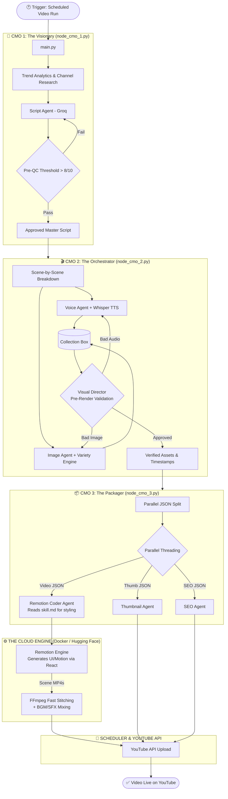

 **YOUTUBE_SYSTEM_DESIGN_v2.md**, isko direct copy-paste maar lo:
```markdown
# YOUTUBE AI FACTORY - SYSTEM DESIGN v2.0
### Architecture: 3-Tier Mastermind + Remotion Engine
**Status:** Upgrading from Monolithic Pipeline to Microservices

---

## SECTION 1 — ARCHITECTURE EVOLUTION (Old vs. New)

**Purane System ki Problems (The 6/10 Spaghetti):**
- **Sequential Bottleneck:** Ek scene fail hone par pura pipeline ruk jata tha.
- **FFmpeg Limitations:** Sirf basic filters aur static color grading milti thi.
- **Race Conditions:** Ek hi prompt aane par assets overwrite ho jate the.

**Naya v2.0 System (The 10/10 Mastermind):**
- **Micro-Masterminds:** Ek single loop ki jagah 3 alag `node_cmo` scripts (Visionary, Orchestrator, Packager).
- **Remotion Engine:** FFmpeg ki jagah React (`.tsx`) code use hoga fluid motion graphics, 2.5D parallax aur ease-in/out animations ke liye. FFmpeg ab sirf end me chote scenes ko jodne (stitch) ke kaam aayega.
- **Parallel Processing:** Video rendering, Thumbnail creation, aur SEO ek sath parallel threads me run honge.

---

## SECTION 2 — SYSTEM FLOWCHART (Mermaid.js)


## SECTION 3 — PROJECT FILE STRUCTURE
Jab workspace banaoge, toh folders aur files is structure mein hone chahiye:
```text
youtube-ai-factory/
│
├── main.py                     # Entry point & Scheduler setup
├── config.py                   # API Keys & Environment Variables 
├── skill.md                    # THE SECRET SAUCE: Motion graphics rules for Remotion
├── Dockerfile                  # Hugging Face deployment (Python + Node.js + FFmpeg)
├── package.json                # Remotion dependencies
│
├── data/
│   ├── channel_analytics.json  # Fetched channel data
│   ├── style_tracker.json      # Visual variety rotation tracker
│   └── logs/                   # System execution logs
│
├── mastermind/                 # The 3-Tier Brain
│   ├── graph.py                # LangGraph orchestration (connecting all 3 CMOs)
│   ├── state.py                # TypedDict for agent states
│   ├── node_cmo_1.py           # The Visionary (Scripting)
│   ├── node_cmo_2.py           # The Orchestrator (Scenes & Collection Box)
│   └── node_cmo_3.py           # The Packager (JSON split & Metadata)
│
├── agents/                     # The Workers
│   ├── script_agent.py         # Writes the actual text
│   ├── voice_agent.py          # Whisper TTS + Timestamps
│   ├── image_agent.py          # T2I pipeline with Variety Engine
│   ├── visual_director.py      # CR Agent for Quality Control
│   ├── remotion_coder.py       # LLM that writes .tsx code using skill.md
│   ├── thumbnail_agent.py      # Generates CTR-heavy thumbnails
│   └── seo_agent.py            # Titles, descriptions, and tags
│
├── tools/                      # Execution Scripts & APIs
│   ├── llm.py                  # Groq/Cerebras fallback wrapper
│   ├── remotion_bridge.py      # Python subprocess that runs 'npx remotion render'
│   ├── ffmpeg_stitcher.py      # Stitches 10s scenes into final video
│   ├── youtube_api.py          # Automated upload handling
│   └── imgbb_uploader.py       # Permanent image hosting
│
└── src/                        # Remotion React Workspace (Dynamic)
    ├── index.ts                # Remotion entry point
    └── Video.tsx               # Base layout (Agents overwrite this dynamically)

```
## SECTION 4 — FALLBACK & LOOP MATRIX
| Component | Target/Agent | Fallback Action / Loop Logic |
|---|---|---|
| **CMO 1 Verification** | Script Agent | 8/10 nahi mila toh regenerate. Max 3 loops, then Drop. |
| **Visual Director (CR)** | Image / Voice Agent | Targeted Fix. Sirf kharab asset regenerate hoga. |
| **Remotion Syntax** | Remotion Coder | Code me error aaya toh compiler log wapas LLM ko jayega fix ke liye. |
| **Image Generation** | Cloudflare / FLUX | Fails → Pollinations.ai → Fails → Puter.js |
| **LLM Calls** | Groq (Llama 70B) | Rate Limit/Fail → Cerebras (Llama 70B) |
## SECTION 5 — ADVANCED UPGRADES (AUDIO & VIDEO PIPELINE)
**1. FFmpeg Integration for 4K Upscaling & Enhancement:**
```bash
ffmpeg -i input.mp4 -vf "
scale=3840:2160,
framerate=60:interp_start=0:interp_end=255:scene=100,
eq=contrast=1.2:saturation=1.1:brightness=0.05,
unsharp=5:5:0.8:3:3:0.4,
vignette=PI/4
" -c:v libx264 -preset slow -crf 18 output_enhanced.mp4

```
**2. Professional Audio Filters (FFmpeg):**
```bash
# Equalization (voice enhancement)
ffmpeg -i voice.wav -af "highpass=f=80,lowpass=f=8000,equalizer=f=1000:t=h:width=200:g=3" voice_eq.wav

# Compression aur Normalization
ffmpeg -i voice.wav -af "compand=0.3,1:6:-70,-60,-20,volume=0.8" voice_compressed.wav

```
**3. Atmospheric SFX Integration (pydub):**
```python
from pydub import AudioSegment

def add_atmospheric_sfx(voice_path, sfx_paths, output_path):
    voice = AudioSegment.from_wav(voice_path)
    final = voice
    for i, sfx_path in enumerate(sfx_paths):
        sfx = AudioSegment.from_mp3(sfx_path) - 20  # Reduce volume by 20dB
        position = i * 30000  # Drop SFX every 30 seconds
        final = final.overlay(sfx, position=position)
    final.export(output_path, format='wav')

```
```

```
